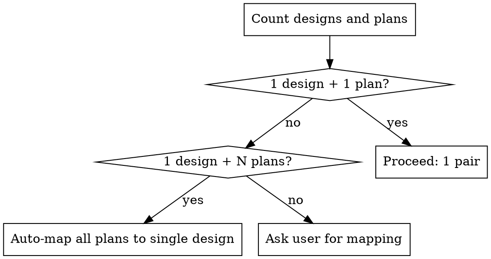

# Review Plan Against Design

Orchestrate verification that plan documents are correctly derived from and consistent with their source design documents.

## Overview

Dispatch reviewer subagents to compare (design, plan) pairs. Each reviewer independently verifies one plan against one design. This file handles file classification, mapping, dispatching, and result aggregation only. All review logic lives in `agents/design-reviewer.md`.

## Step 1: Classify Input Files

Determine which `@` files are design docs and which are plan docs.

**Plans:** filenames containing "plan"
**Designs:** filenames containing "design", "architecture", "brainstorm", "spec", "requirements"

If ambiguous, ask the user.

## Step 2: Determine Mapping



**N designs + M plans — ask the user:**

> I found multiple design docs and plan docs. Please tell me which design verifies which plan(s):
>
> Design docs: {list}
> Plan docs: {list}
>
> Example mapping: "design-auth -> plan-auth, design-api -> plan-api + plan-integration"

## Step 3: Spawn Reviewer Subagents

For each (design, plan) pair, read `agents/design-reviewer.md` and spawn a subagent.

**Single pair:** Spawn one subagent inline (no background).
**Multiple pairs:** Spawn ALL subagents in a **single message** with `run_in_background: true`.

Subagent invocation:

```
Task tool parameters:
  subagent_type: "general-purpose"
  model: "opus"
  run_in_background: true  (only for multiple pairs)
  description: "Review '{plan_filename}' against '{design_filename}'"
  prompt: |
    {paste full content of agents/design-reviewer.md}

    ## Assignment

    ### Design Document
    Read this file: {design_file_path}

    ### Plan Document
    Read this file: {plan_file_path}

    Perform the full review as specified in your instructions above.
```

## Step 4: Aggregate Results

After all subagents return, compile into this format:

```markdown
# Design-Plan Review Summary

## Overall Assessment: [Aligned / Aligned with Fixes / Misaligned]

## Critical Issues (X found)

- [{plan_filename}]: {issue description} [{design_doc}:{section} -> {plan_doc}:{section}]

## Important Issues (X found)

- [{plan_filename}]: {issue description} [{design_doc}:{section} -> {plan_doc}:{section}]

## Minor Issues (X found)

- [{plan_filename}]: {issue description}

## Strengths

- What is well-aligned across the documents

## Summary of Issues

| Symbol | Severity  | Plan Doc Location    | Description                      | Recommendation |
| ------ | --------- | -------------------- | -------------------------------- | -------------- |
| D1-I1  | Critical  | plan-core.md # L:124 | (shortened description of issue) |                |
| D1-I2  | Important | plan-core.md # L:511 | (shortened description of issue) |                |
| D2-I3  | Minor     | plan-data.md # L:33  | (shortened description of issue) |                |

## Recommended Actions

1. Fix critical issues first
2. Address important issues
3. Consider minor improvements
```

**Determination logic:**

- **Aligned**: Zero critical issues, zero or few important issues
- **Aligned with Fixes**: Zero critical but important issues exist, OR 1-2 straightforward critical issues
- **Misaligned**: Multiple critical issues or fundamental design-plan disconnect

If only one reviewer was spawned, use same format without per-reviewer prefixes.
